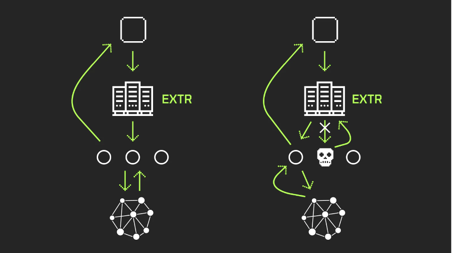
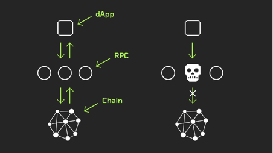

# Extrnode-go
## Why are RPCs so important?
A cryptocurrency wallet does not actually connect to the blockchain. It simply turns actions in the interface into code and then sends it to one of the nodes to be executed and included in the blockchain.

Wallets and other applications send code to pre-selected RPC nodes. If they stop responding and accepting requests, the applications won't work.

Hosting a Solana node is expensive, starting at $1,000 per month, so dApp developers often send requests to public RPC nodes. Those public RPCs, however, are usually hosted by centralized providers like Google Cloud, Amazon Web Services, and Hetzner.

A case in point: in early November, Hetzner discontinued all Solana nodes on its servers, which comprised a whopping 22% of the overall number of nodes. The network survived, but many apps crashed as their selected RPC nodes went offline.



This story shows that trusting only one RPC on a centrally hosted service is dangerous. A dApp developer can reduce the chances of failure with a script, module, or standalone app that automatically switches to a spare RPC endpoint in case of any problem with the primary node. But what if the alternate one fails too? This is the problem we are going to solve with extrnode.

## Why are RPCs so important?
The RPC layer is centralized. Many dApps are connected to RPC nodes run by a handful of major providers and hosted on the same servers. If something happens to the hosting providers or the nodes, the dApps will lose their connection to the blockchain and stop working.

Solana's developers needed a tool to switch their application to a spare RPC node automatically in case of problems with the node in use. So we developed extrnode’s public load balancer, a solution that automatically reroutes application requests to one of the working RPC nodes from a vast cluster.

## How can extrnode help dApp developers?
Developers can be confident that their applications will always have access to an RPC, and users can use those apps without errors or delays. To achieve this without extrnode, developers would have to ask users to manually switch to other RPCs. Building a custom load balancer can only be done by a large team: it takes money, expertise, and active assistance from validators and infrastructure providers.

Using extrnode developers will need to send requests to extrnode's RPC endpoint for the load balancer to reroute them to other RPCs.



## Build and Deployment (local)
- install golang 1.19
- install and setup Clickhouse 23.1. Use migration for clickhouse [init-db.sh](build/clickhouse/init-db.sh)

### Build [scanner](cmd/scanner)
- install nmap from official site (https://nmap.org/)
- setup env vars [.env.scanner.example](.env.scanner.example)
- build
```
CGO_ENABLED=1 GOOS=linux go build -a -v -installsuffix cgo --tags "sqlite_foreign_keys" ./cmd/scanner
```

### Build [proxy](cmd/proxy)
- add your certificates for https server in [creds](creds) dir (optional)
- setup env vars [.env.proxy.example](.env.proxy.example)
- build
```
CGO_ENABLED=1 GOOS=linux go build -a -v -installsuffix cgo --tags "sqlite_foreign_keys" ./cmd/proxy
```

### Build [scanner api](cmd/scanner_api)
- add your certificates for https server in [creds](creds) dir (optional)
- setup env vars [.env.scanner_api.example](.env.scanner_api.example)
- build
```
CGO_ENABLED=1 GOOS=linux go build -a -v -installsuffix cgo --tags "sqlite_foreign_keys" ./cmd/scanner_api
```

### Build [user service](cmd/user_api)
- add your certificates for https server in [creds](creds) dir (optional)
- add firebase.conf in [creds](creds) dir (required)
- setup env vars [.env.user_api.example](.env.user_api.example)
- install Postgresql 11
- create a Postgresql DB
- build
```
CGO_ENABLED=0 GOOS=linux go build -a -v -installsuffix cgo ./cmd/user_api
```

### Run
- `./scanner` to start collecting new nodes
- `./scanner_api` to start scanner api server
- `./user_api` to start user service
- `./proxy` to start proxy balancer

## Build and Deployment (via [docker-compose.yml](docker-compose.yml))
- add your certificates for https server in [creds](creds) dir (optional)
- add firebase.conf in [creds](creds) dir (required)
- place filled [.env](.env.example) file into project root folder
- build:
```
make build
```
- run:
```
make dev
make start
```
- to stop containers run:
```
make stop
```

## Programs command line options
```
-log string
        log level [debug|info|warn|error|crit] (default "debug")
```

## API documentation
Api documentation for swagger located at [swagger.json](swagger/swagger.json)

## DB migrations
All migrations are embedded and tracked by program itself. You have not to track the migrations. All relations, schemes, indexes, so on will be
created within first time run of the data loader

## Running Tests
### Generate mocks
    go install github.com/golang/mock/mockgen@v1.6.0
    make mocks
### Run tests
    make test
### Run for development
Will run dependencies like clickhouse and postgres with ports open locally

    make dev